# ¿Que es EC2?

Amazon Elastic Compute Cloud (Amazon EC2) es una parte central de la plataforma de cómputo en la nube de la empresa Amazon denominada Amazon Web Services (AWS).

# ¿Para que sirve?
EC2 permite a los usuarios alquilar computadores virtuales en los cuales pueden ejecutar sus propias aplicaciones.

# Documentacion:
Primero empezamos por lanzar una instancia:

Despues a la derecha nos aparecera una lista y tendremos que clickar aqui:

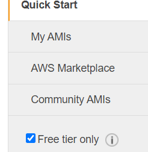

Tenemos que seleccionar la opcion de ubuntu, en mi caso la mas nueva y le damos a select:

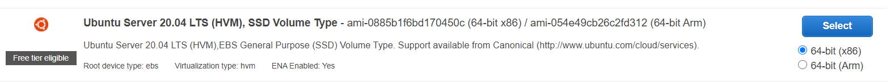

Despues nos aparecera lo siguiente (tendremos uno ya seleccionado por defecto) y le damos a next:

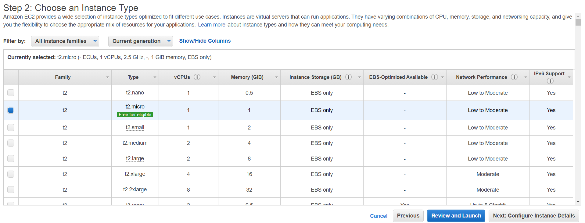

Nos saltara aqui, y le volvemos a dar a next:

Aqui cambiaremos el tamaño y lo pondremos a 30:

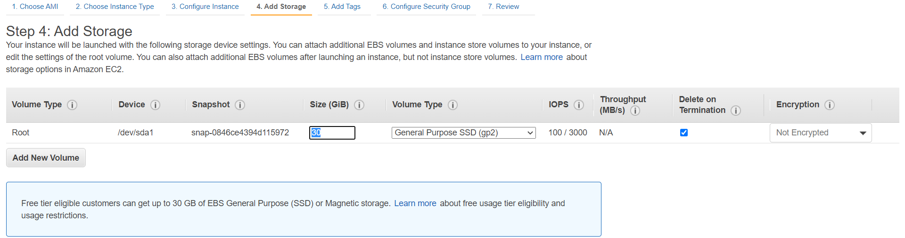

Despues le damos otra vez a Next:

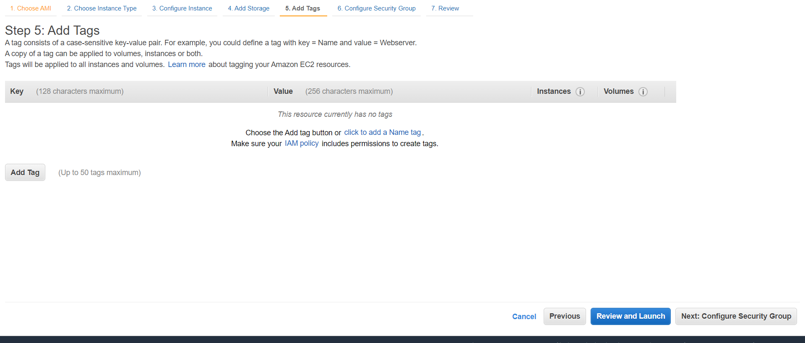

Next:

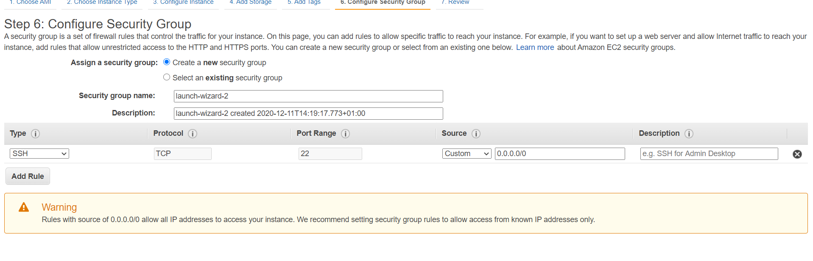

Y ya aqui le daremos a Launch

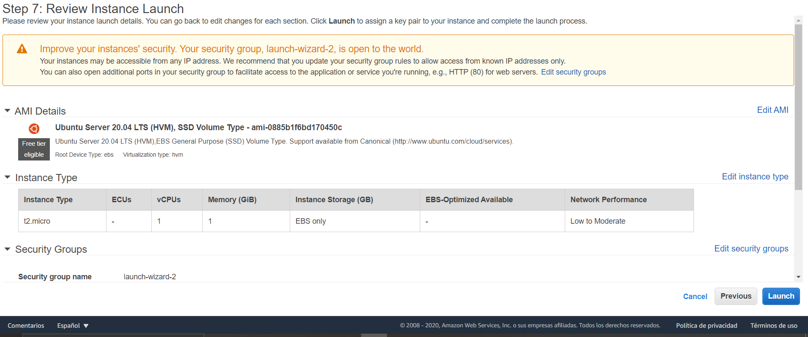

Abajo a la derecha

Aqui nos saldra una ventana en la cual tendremos que crear una clave:

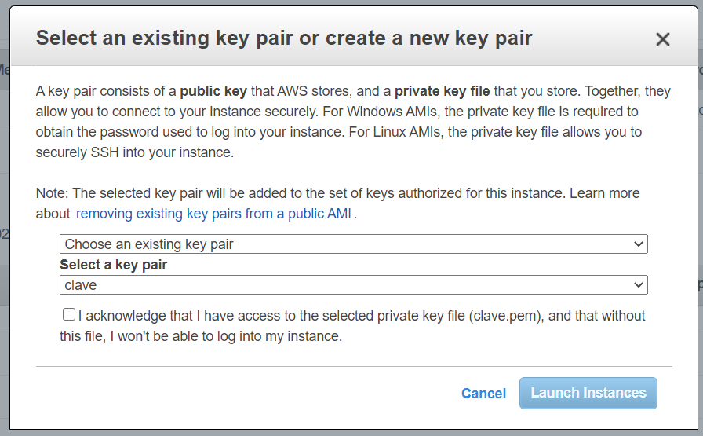

En mi caso lo he llamado clave2, le damos a descargar y lo guardamos bien para saber donde se encuentra Y le damos a Launch instances :

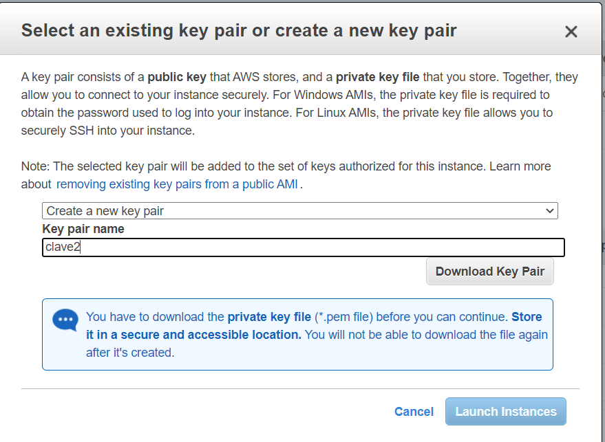

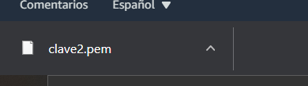

Nos saldra esta ventana:

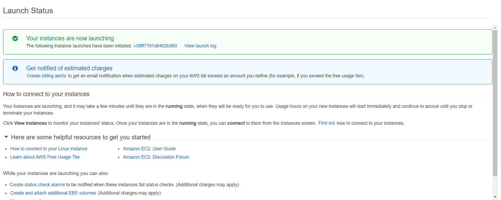

Luego nos vamos a instancias y veremos que ya esta creada:

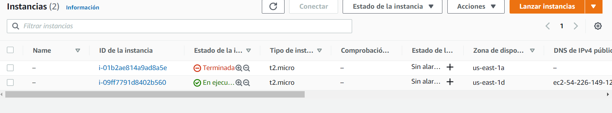

Ahora le daremos a mis acciones y despues a conectar:

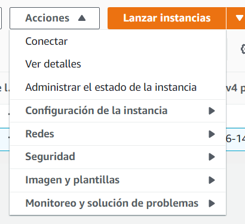

Ahora hacemos click derecho sobre la carpeta donde hemos guardado la clave que habiamos creado, y le damos a Git Bash here (y escribimos el siguiente comando):

Despues copiamos y pegamos este comando:

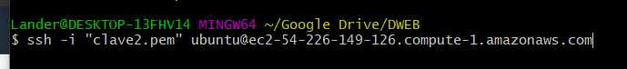

Le tendremos que dar a si para continuar:

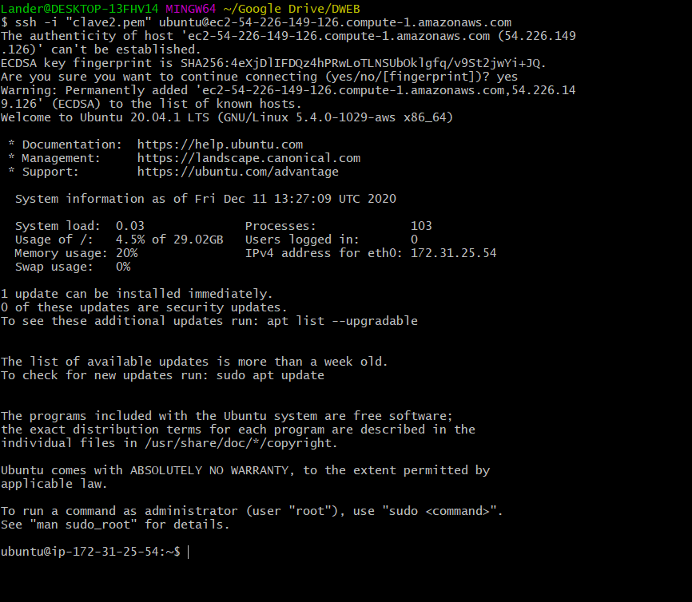

# ¿Que es Apache?

El servidor HTTP Apache es un servidor web HTTP de código abierto, para plataformas Unix (BSD, GNU/Linux, etc.)

# ¿Para que sirve?
Apache permite a los propietarios de sitios web servir contenido en la web

# Documentacion:
Primero empezamos por instalar apache con el siguinte comando:

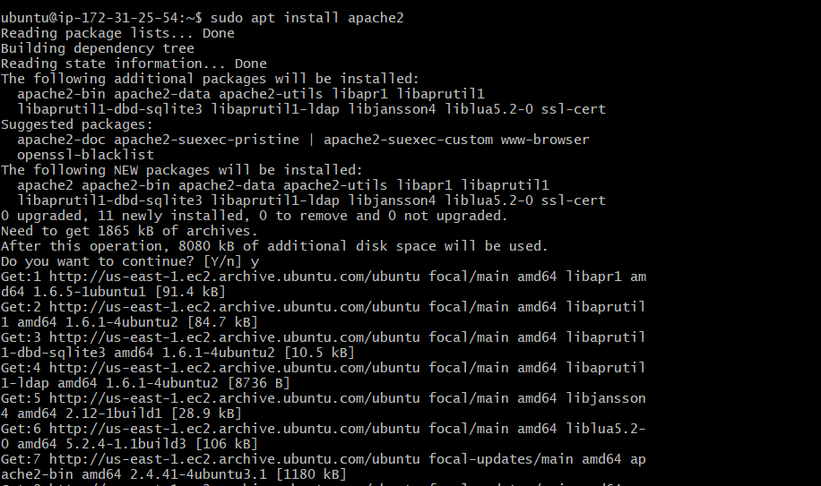

Iniciamos la instancia, y despues debajo de esto abrimos la pestaña de seguridad

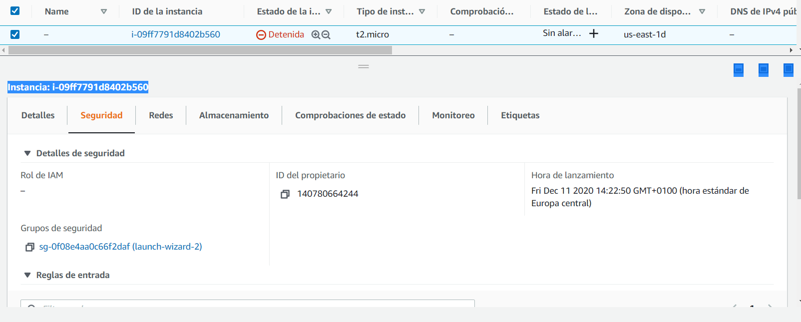

Clickamos sobre el link de grupos de seguridad y despues a editar:

Y nos llevara a esta pestaña:

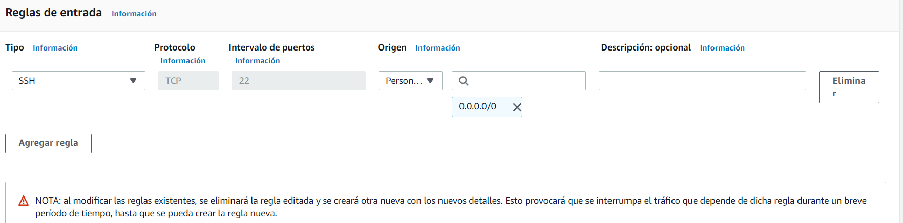

Lo dejaremos asi:

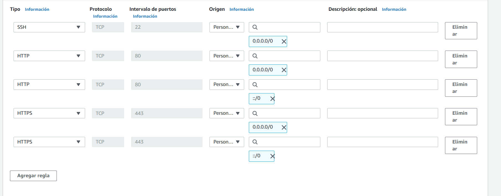

Y le daremos a guardar:

Podemos ver en esta lista todos los cambos que hemos realizado:

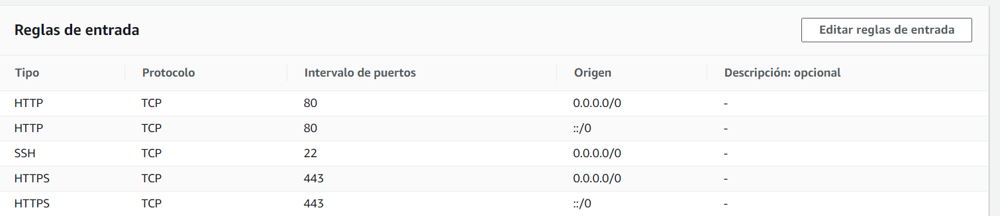

Por ultimo copiamos la ip en nuestro navegador y si lo hemos hecho bien nos aparecera la siguiente ventana:

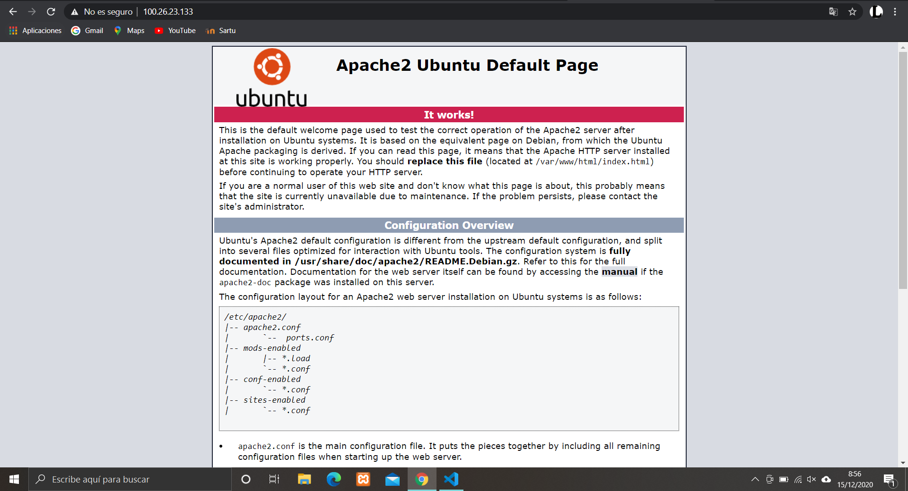

# ¿Que es Mysql?

MySQL es un sistema de gestión de bases de datos relacional desarrollado bajo licencia dual: Licencia pública general/Licencia comercial por Oracle Corporation y está considerada como la base de datos de código abierto más popular del mundo,1​2​ y una de las más populares en general junto a Oracle y Microsoft SQL Server, todo para entornos de desarrollo web.

# ¿Para que sirve?
MySQL sirve para almacenar toda la información que se desee en bases de datos relacionales, como también para administrar todos estos datos sin apenas complicaciones gracias a su interfaz visual y a todas las opciones y herramientas de las que dispone.

# Documentacion:
Primero empezamos por instalar mysql con el siguinte comando:

