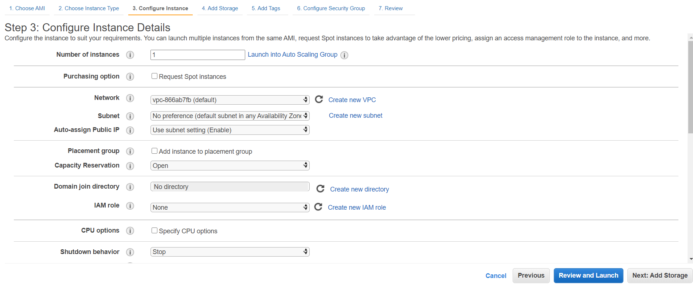
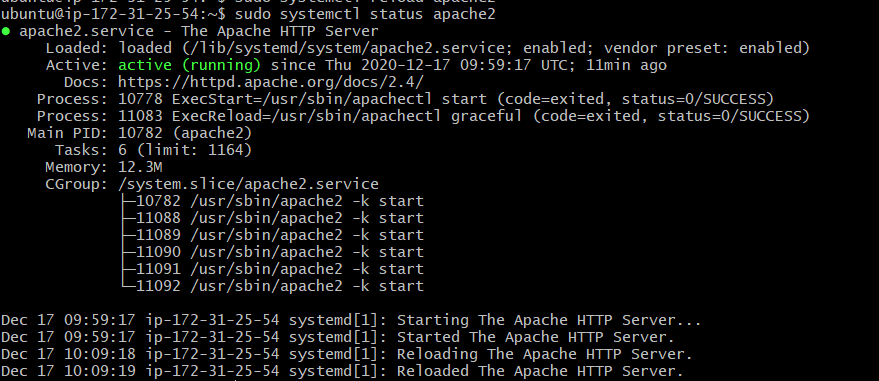

# ¿Que es EC2?

Amazon Elastic Compute Cloud (Amazon EC2) es una parte central de la plataforma de cómputo en la nube de la empresa Amazon denominada Amazon Web Services (AWS).

# ¿Para que sirve?
EC2 permite a los usuarios alquilar computadores virtuales en los cuales pueden ejecutar sus propias aplicaciones.

# Documentacion:
Primero empezamos por lanzar una instancia:

Despues a la derecha nos aparecera una lista y tendremos que clickar aqui:

Tenemos que seleccionar la opcion de ubuntu, en mi caso la mas nueva y le damos a select:

Despues nos aparecera lo siguiente (tendremos uno ya seleccionado por defecto) y le damos a next:

Nos saltara aqui, y le volvemos a dar a next:

Aqui cambiaremos el tamaño y lo pondremos a 30:

Despues le damos otra vez a Next:

Next:

Y ya aqui le daremos a Launch

Abajo a la derecha

Aqui nos saldra una ventana en la cual tendremos que crear una clave:

En mi caso lo he llamado clave2, le damos a descargar y lo guardamos bien para saber donde se encuentra Y le damos a Launch instances :

Nos saldra esta ventana:

Luego nos vamos a instancias y veremos que ya esta creada:

Ahora le daremos a mis acciones y despues a conectar:

Ahora hacemos click derecho sobre la carpeta donde hemos guardado la clave que habiamos creado, y le damos a Git Bash here (y escribimos el siguiente comando):

Despues copiamos y pegamos este comando:

Le tendremos que dar a si para continuar:

# ¿Que es Apache?

El servidor HTTP Apache es un servidor web HTTP de código abierto, para plataformas Unix (BSD, GNU/Linux, etc.)

# ¿Para que sirve?
Apache permite a los propietarios de sitios web servir contenido en la web

# Documentacion:
Primero empezamos por instalar apache con el siguinte comando:

Iniciamos la instancia, y despues debajo de esto abrimos la pestaña de seguridad

Clickamos sobre el link de grupos de seguridad y despues a editar:

Y nos llevara a esta pestaña:

Lo dejaremos asi:

Y le daremos a guardar:

Podemos ver en esta lista todos los cambos que hemos realizado:

Por ultimo copiamos la ip en nuestro navegador y si lo hemos hecho bien nos aparecera la siguiente ventana:

# ¿Que es Mysql?

MySQL es un sistema de gestión de bases de datos relacional desarrollado bajo licencia dual: Licencia pública general/Licencia comercial por Oracle Corporation y está considerada como la base de datos de código abierto más popular del mundo,1​2​ y una de las más populares en general junto a Oracle y Microsoft SQL Server, todo para entornos de desarrollo web.

# ¿Para que sirve?
MySQL sirve para almacenar toda la información que se desee en bases de datos relacionales, como también para administrar todos estos datos sin apenas complicaciones gracias a su interfaz visual y a todas las opciones y herramientas de las que dispone.

# Documentacion:
Primero empezamos por actualizar mysql con el siguinte comando:

Despues lo instalamos con el siguiente comando:

Ahora pasaremos a configurar mysql:

Despues nos pedira crear una contrasña:

Y apartir de ahora daremos que no a todo

Por ultimo, podemos comprobar que lo hemos instalado correctamente:

# ¿Que es PHP?

PHP (Hypertext Preprocessor) es un lenguaje de programación interpretado que se utiliza para la generación de páginas web de forma dinámica.

# ¿Para que sirve?
Enviamos una petición al servidor, ejemplo www.ibrugor.com/blog/index.php
El servidor recibe la petición y busca la página a entregar.
Si la página contiene la extensión «.php», el intérprete de PHP la procesa.
El servidor ejecuta el código PHP de la página y prepara el resultado final, el HTML.
Se envía la página HTML al cliente final.

# Documentacion:
Primero empezamos por instalar con el siguinte comando:

Luego hay que modificar el orden en el que el archivo index.php se enumera en la directiva DirectoryIndex:

Nos abrira este archivo

Y hay que dejarlo asi:

Hay que escribir este comando para que se guarde:

Vemos que esta correcto

Ahora escribimos ese comando para edidtar el archivo:

Escribimos lo siguiente en el archivo:

Y comprobamos que lo hemos hecho bien

# ¿Que es FTP?

FTP es un protocolo de transferencia de archivos entre un ordenador que actúa como servidor y otro que actúa como cliente.

# ¿Para que sirve?
Su función es permitir el intercambio de datos entre diferentes servidores/computadores. Por lo general, los programas servidores FTP no suelen encontrarse en los computadores personales, por lo que un usuario normalmente utilizará el FTP para conectarse remotamente a uno y así intercambiar información con él.

# Documentacion:
Primero empezamos por crear tres usuarios con el siguinte comando:

Ahora procedemos a instalarlo, primero acualizar, despues instalamos::

Ahora iniciamos el servicio:

Ahora añadimos una regla:

Y por ultimo, reiniciamos el sistema:

# ¿Que es una ip elastica?

Las direcciones IP elásticas son direcciones IPv4 estáticas diseñadas para la informática en la nube dinámica.

# ¿Para que sirve?
Con una dirección IP elástica, puede enmascarar los errores de una instancia o software volviendo a mapear rápidamente la dirección a otra instancia de su cuenta.

# Documentacion:
Primero de todo entramos en Direcciones Ip elasticas:

Le damos a allocate Elastic Ip adress

Vemos que lo hemos hecho bien

Y por ultimo, esta comprobacion:

# ¿Qué es y para qué sirve el DNS?
El DNS o Sistema de Nombres de Dominio pertenece a la familia de protocolos de Internet y sirve para resolver los nombres de dominio, es decir, para determinar la dirección IP del servidor donde está alojado el dominio al que queremos acceder.

# Indica cuales son y para qué se usan los diferentes tipos de registros DNS.
- A = Dirección (address). Este registro se usa para traducir nombres de servidores de alojamiento a direcciones IPv4.
- AAAA = Dirección (address). Este registro se usa en IPv6 para traducir nombres de hosts a direcciones IPv6.
- CNAME = Nombre canónico (canonical Name). Se usa para crear nombres de servidores de alojamiento adicionales, o alias, para los servidores de alojamiento de un dominio. Es usado cuando se están corriendo múltiples servicios (como FTP y servidor web) en un servidor con una sola dirección IP. Cada servicio tiene su propia entrada de DNS (como ftp.ejemplo.com. y www.ejemplo.com.). Esto también es usado cuando corres múltiples servidores HTTP, con diferentes nombres, sobre el mismo host. Se escribe primero el alias y luego el nombre real. Ej. Ejemplo1 IN CNAME ejemplo2
- NS = Servidor de nombres (name server). Define la asociación que existe entre un nombre de dominio y los servidores de nombres que almacenan la información de dicho dominio. Cada dominio se puede asociar a una cantidad cualquiera de servidores de nombres.
- MX = Intercambio de correo (mail exchange). Asocia un nombre de dominio a una lista de servidores de intercambio de correo para ese dominio. Tiene un balanceo de carga y prioridad para el uso de uno o más servicios de correo.
- PTR = Indicador (pointer). También conocido como 'registro inverso', funciona a la inversa del registro A, traduciendo IPs en nombres de dominio. Se usa en el archivo de configuración de la zona DNS inversa.
- SOA = Autoridad de la zona (start of authority). Proporciona información sobre el servidor DNS primario de la zona.
- SRV = Service record (SRV record).
- ANY = Toda la información de todos los tipos que exista. (No es un tipo de registro, sino un tipo de consulta)

# Imagen de los registros DNS de tu sitio en Guebs y explicación de los registros de tu dominio grupoX.zerbitzaria.net.

# ¿Cuántos servidores DNS existen?
En la actualidad existen un total de 13 servidores raíz DNS, y están nombrados por letras de la “A” a la “M”. Estos servidores, tienen una dirección IPv4 y una dirección IPv6

# ¿Cuántas redirecciones DNS son posibles?
- Root Server. Como en cualquier jerarquía, cuando hablamos de servidor DNS tiene que existir un nivel superior, un punto en el que una consulta no contestada no pueda subir más y tenga que ser resuelta de un modo u otro. En este nivel superior la consulta será resuelta por un Root Server.
- TLD. Significa “Top Level Domain”. Siguiendo con el ejemplo, el TLD de miweb.es es “.es”. Se trata del dominio “padre”, y es responsabilidad de alguna entidad nacional o internacional que se encarga de gestionar los servidores de nombres que tienen información sobre esta extensión. Por ejemplo, los dominios .es son responsabilidad de nic.es, los .com son responsabilidad de Verisign, etc …

# ¿Qué son los servidores DNS Raíz?
Un servidor raíz (root server en inglés) es un servidor de nombres para la zona raíz del Sistema de nombres de dominio de Internet (DNS).1​ Los servidores de nombres raíz son una parte fundamental de Internet, ya que son el primer paso en la traducción (resolución) de los nombres de host legibles en direcciones IP que se utilizan en la comunicación entre los hosts de Internet.

# ¿Para qué montar un servidor si simplemente escribiendo en un fichero la relación IP/Nombre el sistema ya funcionaría?

# Según lo expuesto, y si en tu configuración de red del sistema operativo solamente posees un servidor DNS, entonces: ¿cuál sería el proceso para encontrar la IP de la dirección web: http://www.debian.org/distrib/netinst?
1. Nuestro equipo verá que no conoce la IP a la que debe conectarse, así que preguntará a un servidor DNS que tenga configurado.
2. A este servidor DNS le llegará una petición. Pero tampoco conoce la respuesta, así que pregunta al siguiente en la jerarquía, es decir, a uno de sus propios servidores DNS.
3. Esto puede ocurrir varias veces hasta que al final la pregunta llega a un Root Server.
4. El Root Server contestará .Entonces dirigirá la consulta a un servidor DNS del dominio padre, o TLD.
5. El servidor del dominio padre de nuevo contestará la consulta, indicando cuáles son los servidores DNS autoritativos para el dominio; en este caso serán ns1.miweb.es y ns2.miweb.es.
6. La petición llega a estos dos servidores DNS, es contestada, y ahora ya todos los equipos por los que ha pasado la consulta van a guardar esta información durante un tiempo.
7. Por último, tu ordenador ya tiene su respuesta y ya sabe a qué IP resuelve el dominio. Hace una conexión a ella, pide la página web y te la enseña.

# ¿Es posible si dispones de una conexión a Internet con IP dinámica ofrecer servicios en Internet? Es decir, si quieres ofrecer los servicios SND, no dispones de IP estática, esto es, cada vez que te conectas a Internet tu IP, aunque a veces sea la misma, no siempre es la misma.

# ¿Qué es ICANN?
Internet Corporation for Assigned Names and Numbers (ICANN) es una organización sin fines de lucro que opera a nivel internacional, responsable de asignar espacio de direcciones numéricas de protocolo de Internet (IP), identificadores de protocolo y de las funciones de gestión [o administración] del sistema de nombres de dominio de primer nivel genéricos (gTLD) y de códigos de países (ccTLD), así como de la administración del sistema de servidores raíz. Aunque en un principio estos servicios los desempeñaba Internet Assigned Numbers Authority (IANA) y otras entidades bajo contrato con el gobierno de EE.UU., actualmente son responsabilidad de ICANN.

